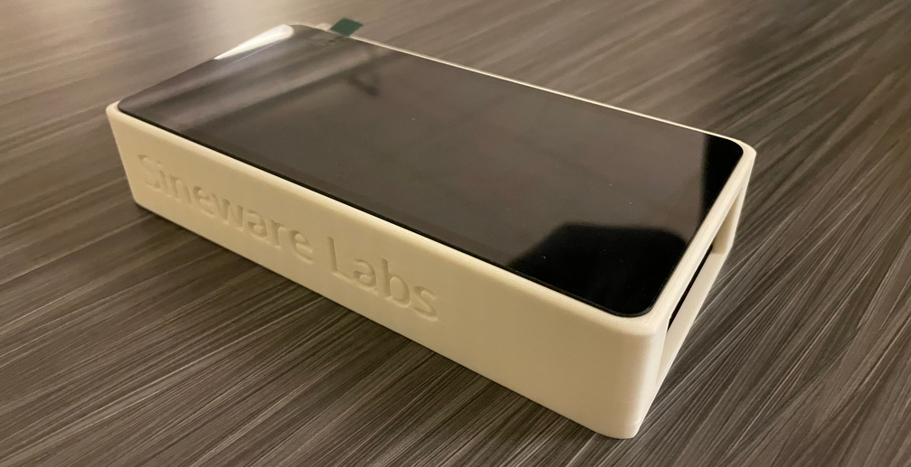

# Sineware Protopocket

The Protopocket is an open source reference development platform for mobile mainline Linux. It's a chonky phone you can build yourself!

## Why?
While there are many great phones that can run Linux today, the Protopocket fills a niche of being designed specifically for development purposes, and being fully OSHW that any individual can build themselves. While it won't be great as a daily driver:
- Builds on a well support, predictable platform (Raspberry Pi)
- Easy to debug (easy serial access)
- Modular (Swap in different hardware to test as needed)

## Hardware
The hardware as defined in this repository is "rolling", the specifications, configs, devicetrees, etc will evolve as the projects develops.

Current hardware:
- 3D printable case
- Raspberry Pi Compute Module 5
- Waveshare Mini Base Board (B) CM5
- Waveshare 6.25inch DSI Capacitive Touch Display
- Adafruit LSM6DSOX + LIS3MDL (ID 4517) Accelerometer/Gyroscope

Todo:
- LTE/5G Modem
- USB-PD Battery Charger, Fuel Gauge
- Ambient Light Sensor, Proximity Sensor
- Camera(s) (USB or CSI) 

3D Printed Enclosure: https://www.printables.com/model/1266920-waveshare-625inch-dsi-display-case-for-raspberry-p

## Building
Instructions coming soon!